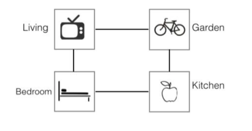
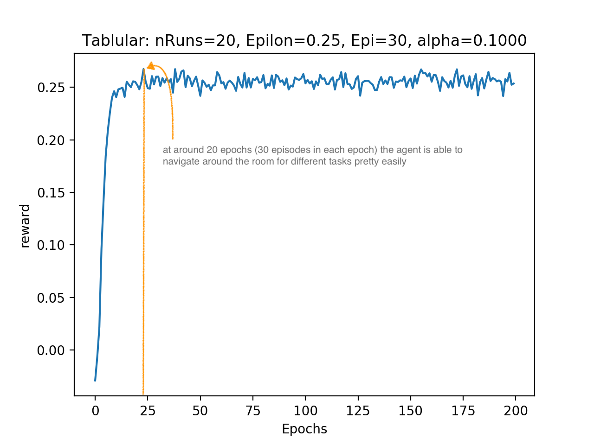
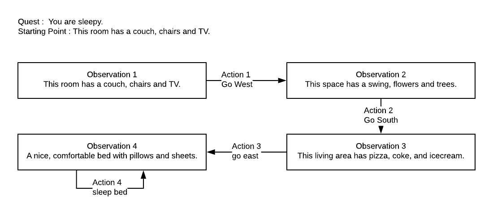
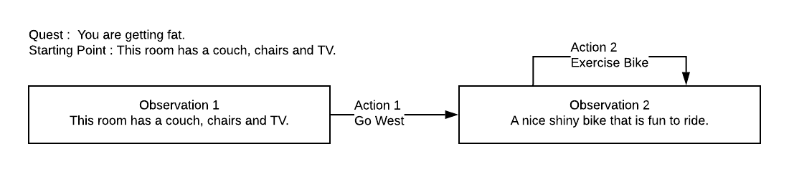

# Language Understanding in Text Based Games
### Environment Details

The environment is home world and has the following structure,



You can be at any of the above areas. The state is however hidden and you are only given a description of where you are,
<br> Example– 'A huge television that is great for watching games'. This means you are in the living room.

Now you are given a quest to complete, example– 'You are sleepy.'
<br> The purpose of the agent is to navigate through the house and find the appropriate space 
where the quest can be achieved.

Remember that each state you land in, you can only know where you are by the description
of the place. The state is always hidden.

You can download the environment from here [https://github.com/cyberyu/uot_intern/blob/master/resources_rl.tar.gz](https://github.com/cyberyu/uot_intern/blob/master/resources_rl.tar.gz)
## Tabular Q Learning Results

In a universe where all the states can be described by a finite set of sentences, a tabular Q learning approach works pretty good (definitely not perfect).
Here are the results from the environment,



Following is a visualization of the history the agent saw while navigating,

Note that since the agent hasn't learnt the language model itself, a shorter path between Observation 1 to Obervation 4 could not be discovered.

Another flowchart is,


A text form of these visualizations can be obtained with ```visualize_path``` function in [agent_tabular_ql.py](agent_tabular_ql.py)
Note that the functions ```tabular_q_learning``` and ```epsilon_greedy``` in [agent_tabular_ql.py](agent_tabular_ql.py) are missing due to privacy constraints of the competition and will be uploaded as soon as the competition is over.
